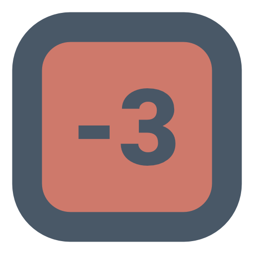

# Mural

Mural is a game where you have to guess the image by flipping over tiles. Each tile has a penalty and the goal is the get the highest score. As you get closer to the inside the penalties go up.

It is hosted on my portfolio website at mural.andrewnathan.com.

It is open source, but doesn't have a lot of the infrastructure to handle contributions yet. If you have questions or want features. Please put in issues.

The game is refreshed daily at 11:59 EST so feel free to send it to your friends and play!
